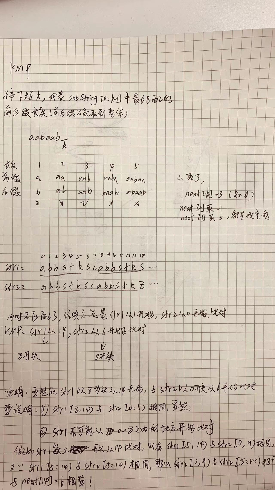
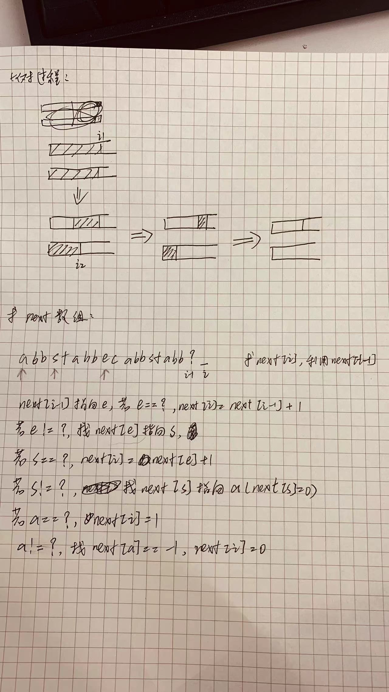

# kmp-cpp
## 写出代码的关键在于理解两次模拟的过程：
### kmp的过程:
- 二者匹配时 i1++,i2++;
- 遇到不匹配的字符时，i1停在原地，i2不断往前找，
- 若i2无法再往前，即为-1时，i1++
### getnext的过程:
// cn保存两个一样的信息，比对时的字符下标和next[i-1]，这两个是一样的。

// 初始化：next[0]=-1,next[1]=0
- 求 next[i] 主要利用 next[i-1] ,如果 s[i-1] == s[cn] , next[i] = next[i-1]+1 ,即是next[i++]=++cn
- s[i-1]!=s[cn]时,cn前移，cn=next[cn],
- 当cn=0时停止，next[i++]=0

